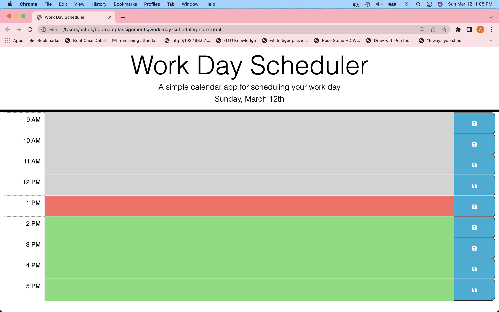
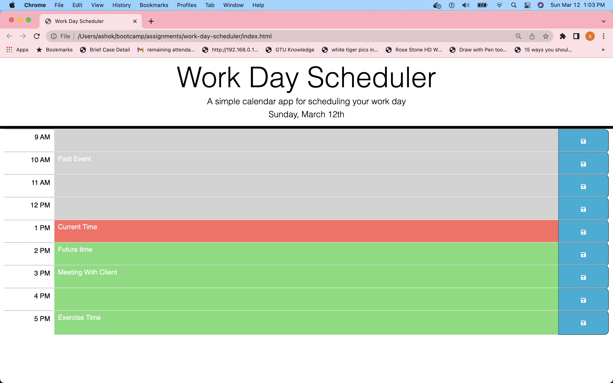
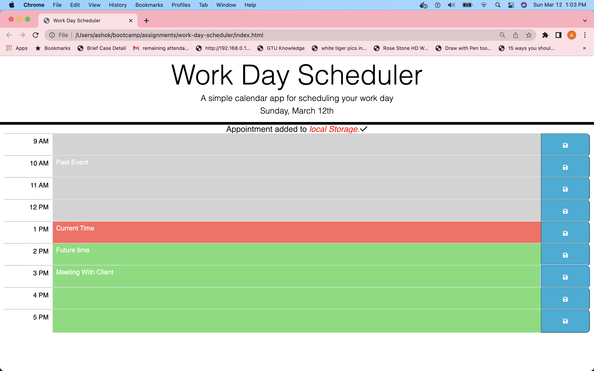
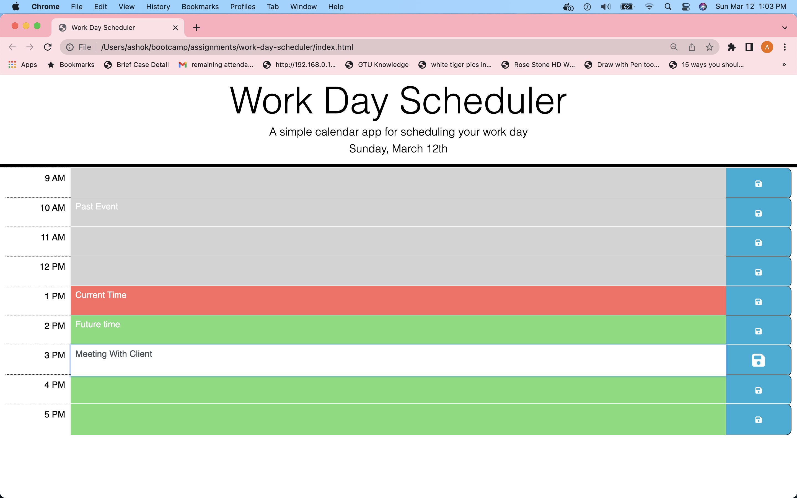
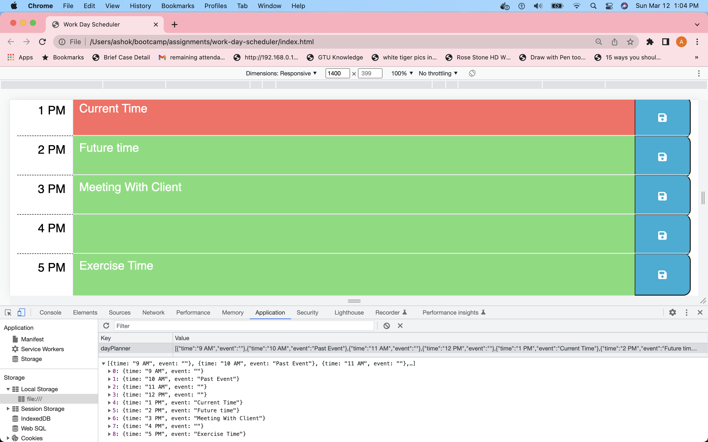

# work-day-scheduler
Calendar application that allows a user to save events for each hour of the day.

## Description

Here I made Calendar application that allows a user to save events for each hour of the day.As employee with a busy schedule can add important events to a daily planner so that employee(user) can manage their time effectively.Here I use HTML,CSS,Javsscript, external fonts and icon, Bootstaps so I also improves my knoweldge on this topics.

## Table of Contents

## Installation
    N/A

## Usage

work-day-scheduler is a one type of planner or calender application in which user can add events for particular time.In work-day-scheduler application you can first see current day like in format "day, month date" example today is Sunday,March 12th. then you can see business hours time like 9AM to 5 PM in this each time hour has particular color like current(present) hour is display with color red, past hour is display with color gray and future hour display with color green.when user click on particular hour time block then user can enter some text(events) in it. and when user click on save icon button then this event store in localstorage so if user referesh the page then events persist on the page.and also when user click on save icon button it display message like "Appointment added to local stroage" on screen.So from using work-day-scheduler applcation user can save their events on particular time block so user can see on what time what they have to do this is like gentle reminder for user what to do in business hours so through this application use can increase their work and time efficiency can improves

here I can attached some screenshots of work-day-schuduler applicaiton and links .

1. The URL of the work-day-scheduler functional, deployed application - https://avanijadeja.github.io/work-day-scheduler/

2. The URL of the work-day-scduler GitHub repository - https://github.com/avanijadeja/work-day-scheduler

3. Screenshots of work-day-schduler application outputs.

## Credits

1. for this application I used like HTML,CSS,Javascript which I learned in my bootcamp class and also I learned from https://w3schools.com/.

2. I am using font and icons form website https://fontawesome.com/icons. 

3. I am using bootstap class fluid so first I read from this https://getbootstrap.com/docs/5.0/layout/containers/ and then I decide to use container-fluid class in my application.

4. I am using date moment() function I read and implement using https://cdnjs.cloudflare.com/ajax/libs/moment.js/2.24.0/moment.min.js.

## License 
please refer to the LICENSE in the repo.

